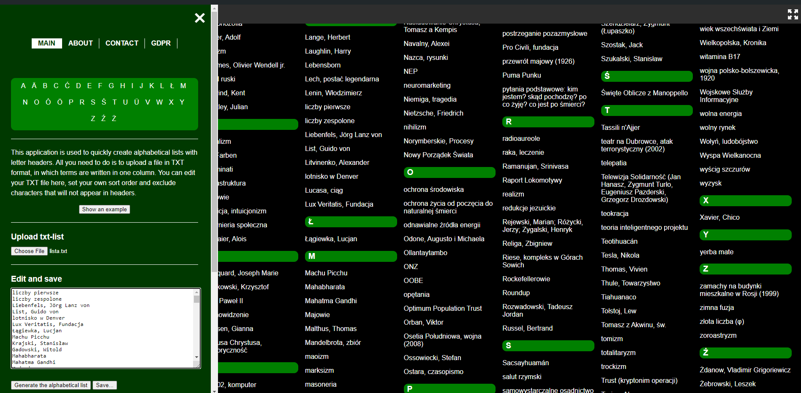

# Myall Project


## Description
This application is used to quickly create alphabetical lists with letter headers. All you need to do is to upload a file in TXT format, in which terms are written in one column. You can edit your TXT file here, set your own sort order and exclude characters that will not appear in headers.

[DEMO](https://rudolphreti.github.io/MyAll/)



## Features
- **Interactive Lists**: Manage and display lists dynamically.
- **Custom Navigation**: Enhanced side navigation for better user experience.
- **Cookie Notification**: GDPR compliant notification system.
- **Duplicate Removal**: Utility to clean up lists by removing duplicate entries.

## Installation

1. Clone the repository:
   ```
   git clone [repository-url]
   ```
2. Navigate to the project directory:
   ```
   cd Myall
   ```
3. Open the `index.html` in your browser to view the project.

## Usage
- **Expand Navigation**: Click on the navigation bar to expand and view additional options.
- **Add/Remove Entries**: Use the interface provided to add or remove entries from the list.

## Contributing
Pull requests are welcome. For major changes, please open an issue first to discuss what you would like to change.

Please make sure to update tests as appropriate.

## License
[MIT](https://choosealicense.com/licenses/mit/)
